<post-header />

I don't know if anyone remembers Facebook early on when people covered their
profiles with application widgets.
One of those applications was Graffiti.
A lot of people had it, and I loved surprising people with high quality graffiti
on their wall.
I drew all sorts of things, usually related to the random victim.
I almost entirely drew from reference, looking at what I am drawing.

Without further ado, here they are in a *chronologically ascending order*:

Admittedly, they start out pretty bad. But I promise they get better. So much better.

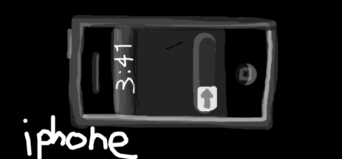

I drew this depiction of the [first iPhone](http://en.wikipedia.org/wiki/IPhone_(original)) for Jon.
He loves his Apple products.
I am still not a fan of Apple.

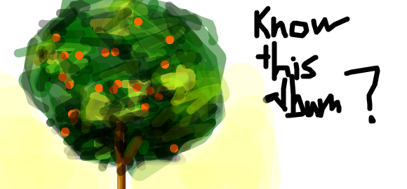

I drew this for Rex before Cartel released their [self-titled album](https://en.wikipedia.org/wiki/Cartel_(Cartel_album)).
He didn't know what it was and I had to tell him.

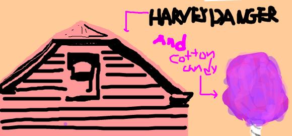

This is a depiction of Harvey Danger's album [Where Have All the Merrymakers Gone?](http://en.wikipedia.org/wiki/Where_Have_All_the_Merrymakers_Gone%3F).
I actually met a friend of mine, Allison, via this song.
Back when Facebook was a garbage dump of applications,
one application allowed the user to upload a song so people can play it on your profile.
Allison and I were both friends of Amanda and we both uploaded this song to our profiles.
So Amanda told us both and I sent her a message on Facebook and eventually we became really good friends.
I don't remember what the cotton candy is about. =\

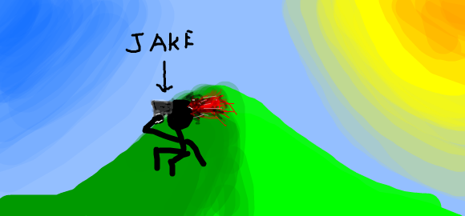

This is the first of a series of my friends and I drawing each other dying in various ways.
This one depicts Jake shooting himself on a gradiented hill and gradiented sky lit up by a gradiented sun.
I guess I discovered gradients were easy at this point.

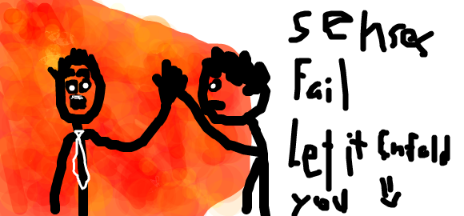

I drew this one for Allison because we were about to go to a Senses Fails concert at Headliners in Louisville, KY.
It is a depiction of [Let it Enfold You](http://en.wikipedia.org/wiki/Let_It_Enfold_You).
I loved Senses Fails so much.

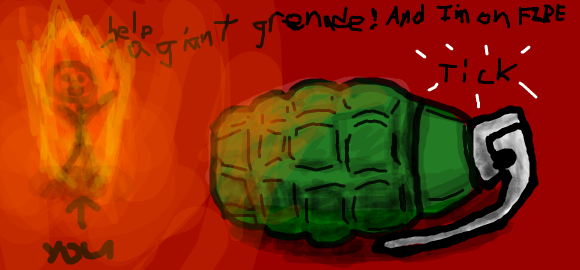

Watch out Jake! That grenade is going to kill you as you burn to death!

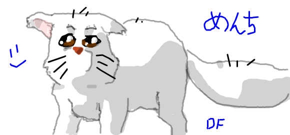

Here is the dog [Menchi (メンチ)](http://en.wikipedia.org/wiki/List_of_Excel_Saga_characters#Menchi)
from [Excel Saga](http://en.wikipedia.org/wiki/Excel_Saga).
Trust me, it is a dog and not a cat.
I drew this for Sarah.
I had just met her at this point at a LAN party at either Garrett's house or Garrett's cousin's house.
I believe she was actually sad about something at the time and I drew this to cheer her up.

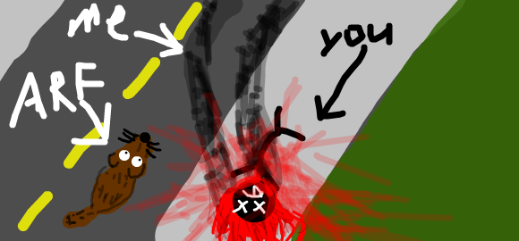

Now Jon and I were having at each other in graffiti death. As you see, the person driving the car, me, swerved around the dog to hit the object of less value, Jon himself.

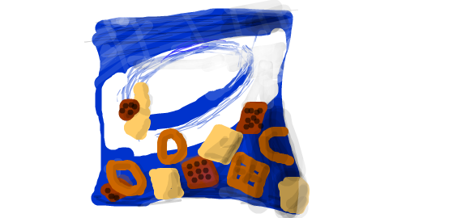

This was a drawing for Mandy. I don't remember the joke behind [Chex Mix](http://en.wikipedia.org/wiki/Chex_Mix),
but there was a joke here.
I had just met her during the Summer.
I don't remember if we met in the math office or at a local concert.

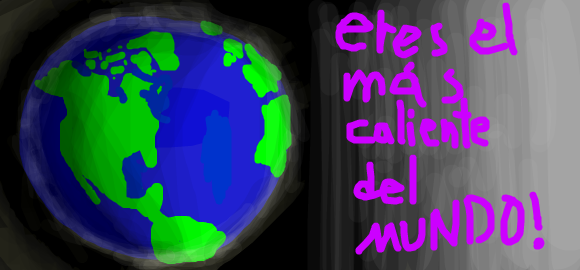

I had a thing for Mandy and drew a picture with a flattering phrase in Spanish.
It reads, "You are the hottest in the world!"

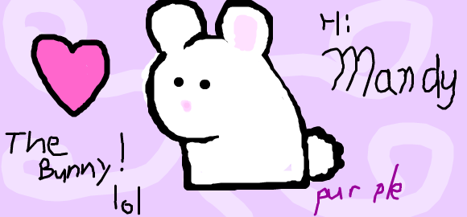

Nothing special here. Just a cute drawing of a bunny for Mandy.

Mandy was sick at the time so I drew this to cheer her up.
[The cat](./images/graffiti_azumanga_daioh.png) is from [Azumanga Daioh](http://en.wikipedia.org/wiki/Azumanga_Daioh).
The Japanese reads, "Bad cat."

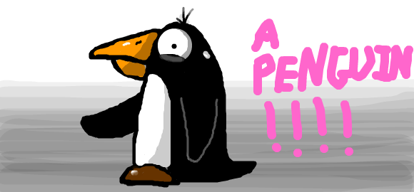

I believe this was for Darrah on a random request. A penguin.

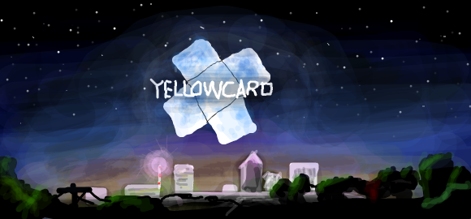

I believe this was for Darrah again, but this is when I started getting serious about detail.
Yellowcard announced their new album [Paper Walls](http://en.wikipedia.org/wiki/Paper_Walls) and I was excited about it.
I'm not entirely sure what I drew here because it doesn't match the album cover.
I either drew an early rendition of the cover or I took a lot of liberty improvising.

I remember when it first leaked to the internet and I quickly downloaded it and
listened to it during my internship doing spectral analysis in Ferdinand, IN.
It was a really good album then and is still a really good album.

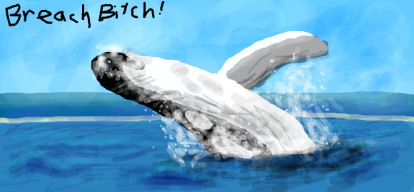

This was for one of my best friends, Jay.
A humpback whale breeching.
I guess we took a little too much privilege in poking fun at his weight.
But we always used to tell him to [breach](http://en.wikipedia.org/wiki/Whale_surfacing_behaviour#Breaching.2C_lunging.2C_and_porpoising)
in the pool and he was a good spirit about it.
He has actually lost a lot of weight since then.

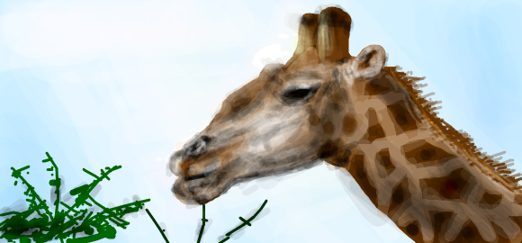

This giraffe was for my friend Amanda. Giraffes are her favorite animal.
I still never fail to send her any comics that come up that include giraffes to her.
I believe she has said her dream house involves many giraffes in the yard.

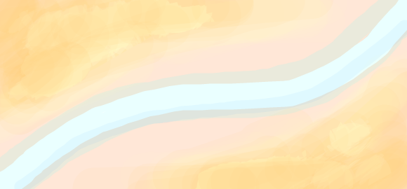

I drew this for Grant.
I don't remember what I was trying to do.
I think it was a river in a desert, but ended up looking like a flag.

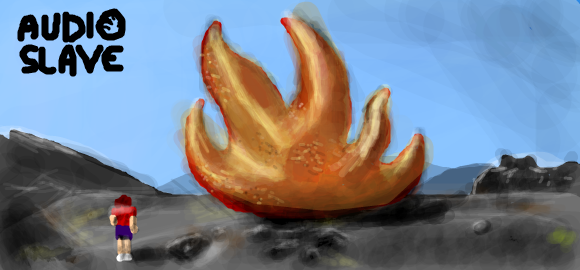

My friend Noah, being a good skeptic, was not convinced I was drawing these by hand.
So he challenged me to draw one in front of him.
I looked through my album covers and chose this [self-titled](http://en.wikipedia.org/wiki/Audioslave_(album))
album by Audio Slave, a band we both enjoy.
I drew it on his wall and he watched me do it, stroke by stroke to his amazement.
Damn that felt good.

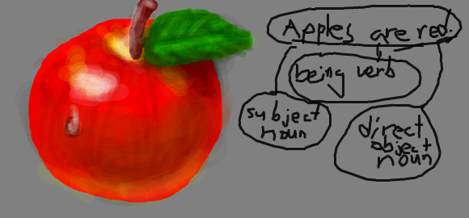

This apple with a grammatical breakdown was for Rebekah,
a girl I met at a party at Allison's house and now goes to Purdue.
We watched [The Shining](http://en.wikipedia.org/wiki/The_Shining_(film)) at that party.
Rebekah and I got into a disagreement about the [purpose color words](http://dictionary.reference.com/browse/red)
have in English.
I don't remember what all was said, but I think my English breakdown here is a little fishy.
The apple isn't though, it looks delicious.

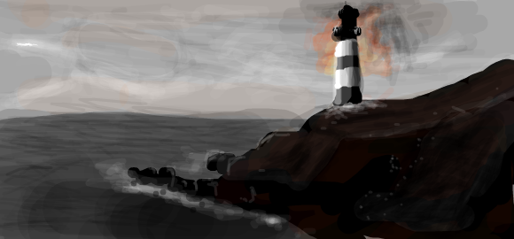

This was for the random victim Anna.
I had to do a scavenger hunt for the album since I could not remember what it was.
I kept searching for albums with the word "Ace" in it.
But alas, going through my [last.fm library](http://www.last.fm/user/ceramic_spider/library)
page by page finally found it.
Luckily it was in the "A" section.
[The Possibility and the Promise](http://en.wikipedia.org/wiki/The_Possibility_and_the_Promise) by Amber Pacific.

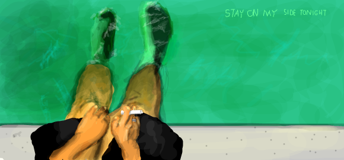

This melodramatic piece is for my friend Jessica, an avid Jimmy Eat World fan.
The album is an EP: [Stay on My Side Tonight](http://en.wikipedia.org/wiki/Stay_on_My_Side_Tonight).
Let it be known, Jessica is no Hitler.
She loves the JEW.

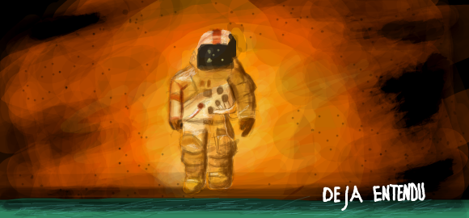

This one went to Noah.
A depiction of Brand New's [Deja Entendu](http://en.wikipedia.org/wiki/Deja_Entendu).
I just wanted to draw an album cover of an album I really liked.

This one went to my good friend Adam. He was a Nintendo fan boy. But, everyone loves Nintendo.

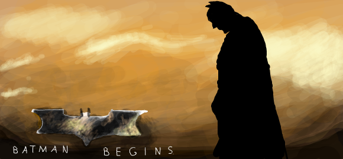

This was for a Louisville friend of mine, Brooke.
She is a fan of Batman, but I think she is more a fan of the classic Batman.
But, since I am a fan of the [new Batman](http://cache2.allpostersimages.com/p/LRG/18/1856/KOH8D00Z/posters/batman-begins.jpg),
I drew her the new batman.
I remember my brother joking about how his knee looked like an erection.

On an aside, I remember Brooke telling me she met a girl at her university at
Louisville and their introduction dialog with each other was about how they both
discovered they both knew me.
I felt so popular.

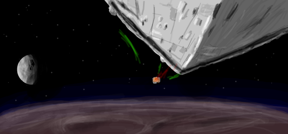

This was for the random victim Gregg.
I don't really know Gregg, but I knew enough to know he loves Star Wars.
Which I too am a huge fan of.
This is the epic [opening scene of episode IV](http://www.youtube.com/watch?v=z33-qOXOWS4&feature=related).
I sure hope he appreciated the random gift.

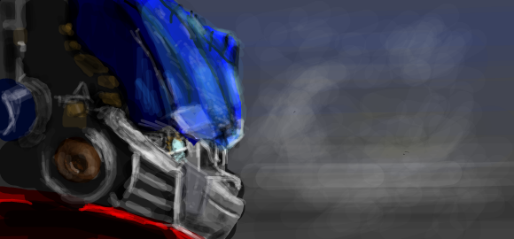

This was for Allison before the first new Transformers movie came out.
This is Optimus Prime as he shows up in the [promotional posters](http://www.ilovesubstance.com/images/movies/transformers_movie_poster_optimus_prime.jpg).
The movie sucked.

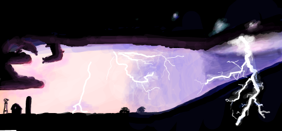

I drew this for Katelynn. We had a joke about thunderstorms.
I won't go into any details on that one.

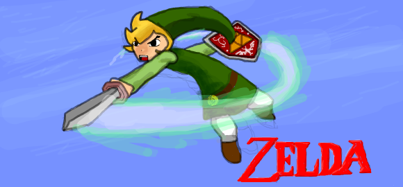

Once again, a Nintendo character drawing for Adam.
This one is [Link](http://images.wikia.com/zelda/images/9/99/Link_Wind_Waker_11.png) from Zelda: Wind Waker,
possibly my favorite Zelda game.
I know, you hate the cell-shading, but those of us that don't, think it is the most fun one.

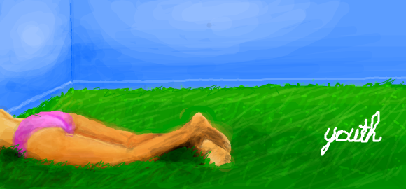

I drew this for the random victim Kami.
I met her in the math office in high school.
She was taking a make-up exam when I was goofing off in there.
Kami and I actually talked quite a bit.
She was a really cute girl.
This one is an album cover for Collective Soul's [Youth](http://en.wikipedia.org/wiki/Youth_(Collective_Soul_album)).

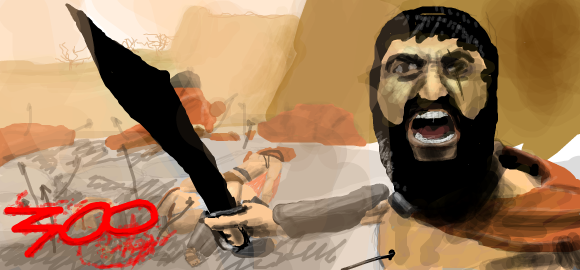

This was for Jake.
I think he drew a scene from 300 so I drew [one back](http://manhattaninfidel.com/__oneclick_uploads/2010/12/300_movie.jpg).
I'm actually quite enthused by how well I did on his face.

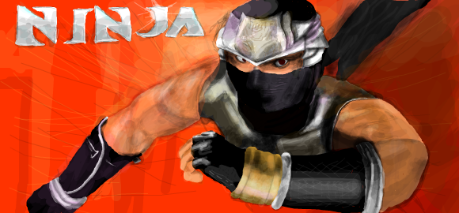

This was the last one.
It was for Jay.
He drew a picture of himself as a ninja and me as a pirate getting killed by his ninja star.
That wasn't the first drawing of a depiction of us as pirates and ninjas where ninjas are kicking ass,
but I retaliated this time with a sweet picture of the ninja from [Ninja Gaiden](http://th04.deviantart.net/fs26/PRE/f/2008/150/7/5/Ninja_Gaiden_Wallpaper_by_igotgame1075.jpg).
Not the best way to retaliate.
Oh, and I thought the game sucked.
