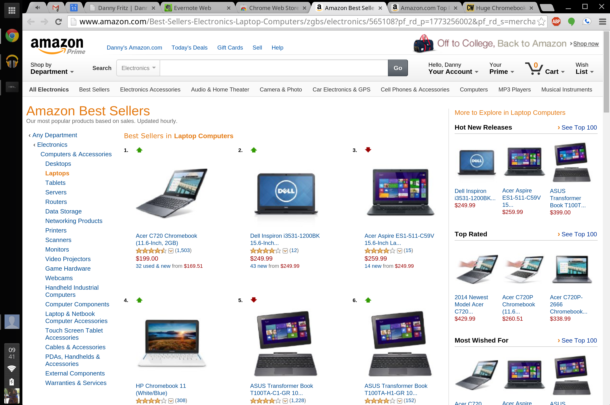
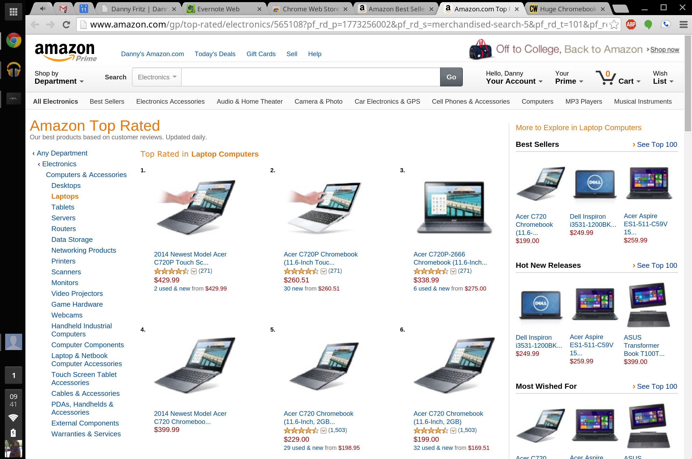
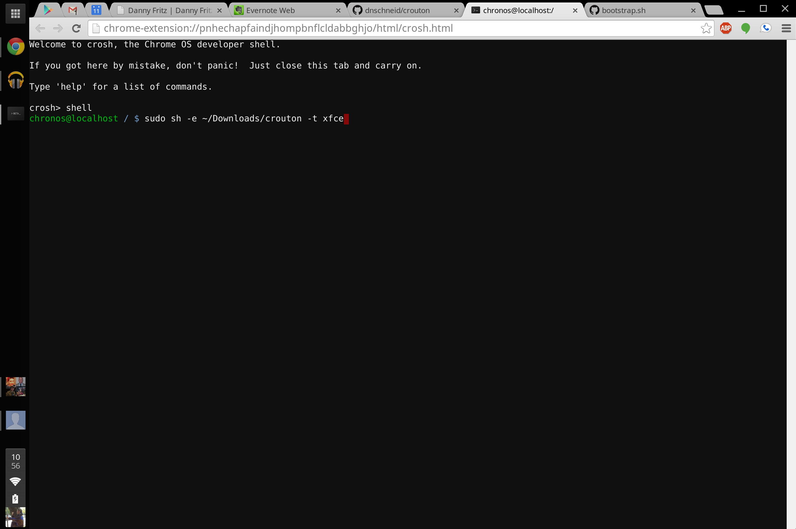

<post-header />

## Chromebooks and Chrome OS

Chromebooks are great machines that run Chrome OS.
Chrome OS lets you focus on your work, boot up quickly, cost very little,
extend your battery life, be secure, and get frequent updates.
These machines seriously kick ass.

This post goes over how to get the most out of your Chromebook.

## People Don’t Want to Buy Them

The headline of this section is a little sensationalized.
Chromebooks are [incredibly popular right now](http://blogs.computerworld.com/itbwcw/20140402/chromebook-sales-abi-research)
and they are among the top-rated and best-selling laptops on Amazon.





A lot of people don’t want a Chromebook because they are “glorified browsers” that can’t do anything useful.

> "I use more than a browser! How could I ever be satisfied with a Chromebook?"

Here is a short list of the things I hear that keep people from buying a Chromebook:

1. Can’t run Microsoft Office
2. Can’t be used for development
3. Can’t be used to play games

## Why You are Squabbling

Now ask yourself, how often are you using your computer solely for a browser? Chances are if you are like most people, most of the time.

Microsoft Office is released on the Chrome Web Store.

- [Word](https://chrome.google.com/webstore/detail/word-online/fiombgjlkfpdpkbhfioofeeinbehmajg?hl=en)
- [Excel](https://chrome.google.com/webstore/detail/excel-online/iljnkagajgfdmfnnidjijobijlfjfgnb?hl=en)
- [Outlook](https://chrome.google.com/webstore/detail/outlookcom/pfpeapihoiogbcmdmnibeplnikfnhoge?hl=en)
- [Powerpoint](https://chrome.google.com/webstore/detail/powerpoint-online/mdafamggmaaaginooondinjgkgcbpnhp?hl=en)

There are also alternatives such as [Google Drive](https://www.google.com/intl/en/drive/).
I definitely prefer Google Drive.

And with a more traditional Linux distro running on your Chromebook, you can run games and develop programs.
We just need a little help from our friend [Crouton](https://github.com/dnschneid/crouton).

## Enter Crouton

Crouton enables us to run [Ubuntu](http://www.ubuntu.com/) (and others) with ease on our Chromebooks.
Ubuntu has official Steam support and is fully capable of development.
Android Studio, Node.js, Sublime Text 3, Atom, Chrome, Firefox, and Opera all have Linux builds.
Heck, you can even do C# development with [Mono](http://www.mono-project.com/Main_Page) on Linux.
And if you really miss Windows, you can try out [Wine](http://www.winehq.org/) or run Windows in a [Virtual Box](https://www.virtualbox.org/).

Crouton enables your Chromebook to do all of these things you associate with a more traditional OS such as Windows or OSX.

## Preparing your Chromebook

All you need to install Crouton is a Chromebook that is in [development mode](http://www.chromium.org/chromium-os/poking-around-your-chrome-os-device#TOC-Putting-your-Chrome-OS-Device-into-Developer-Mode).
[Getting into development mode](http://www.chromium.org/chromium-os/developer-information-for-chrome-os-devices)
is usually a very easy process depending on the Chromebook.

For my Chromebook Pixel I held down `Escape + Refresh + Power` and then hit `Ctrl + D`. And that was it.

## Tossing the Salad (Installing)



Now for installing Crouton. Don’t worry.
It is super easy.

1. Download Crouton from the link at the top of the [Github repo](https://github.com/dnschneid/crouton)
2. Open up your shell with `Ctrl + Alt + T`
3. Enter `shell`
4. Enter `sudo sh -e ~/Downloads/crouton -t xfce`
5. Wait for it to finish
6. Follow onscreen prompts for username and password
7. Enter `sudo startxfce4`
8. Enjoy Ubuntu!

## Some Quick Usage Notes

Now to go back and forward from Ubuntu and Chrome OS seamlessly, hit `Ctrl + Alt + Shift + Back/Forward`.
It really is as easy as that.

If you run into a problem, go ahead and search and then open up an issue on the Github [issue tracker](https://github.com/dnschneid/crouton/issues).
They are super responsive and helpful.

## My Personal Install Script

This is my personal crouton command and subsequent commands to bootstrap my Ubuntu install:
```sh
# Start Crouton
sudo sh -e crouton -r trusty -t chrome,cli-extra,gnome,keyboard,audio
```
```sh
# Bootstrap Ubuntu
sudo apt-get install software-properties-common
sudo apt-add-repository ppa:chris-lea/node.js
sudo apt-add-repository ppa:fish-shell/release-2
sudo apt-add-repository ppa:webupd8team/sublime-text-3
sudo apt-get update
sudo apt-get install apt-file man-db ppa-purge vim git subversion mercurial terminator sublime-text fish htop nodejs tmux
sudo apt-get dist-upgrade
sudo apt-get autoremove
chsh -s /usr/bin/fish
```
